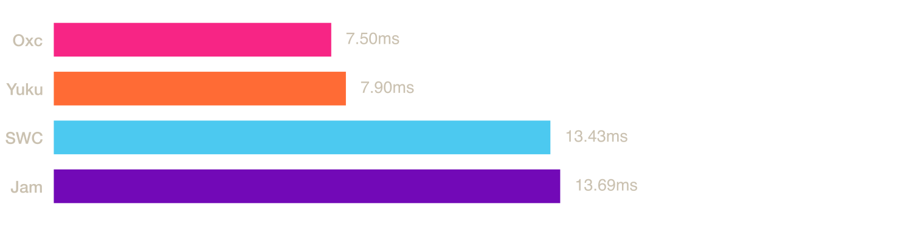
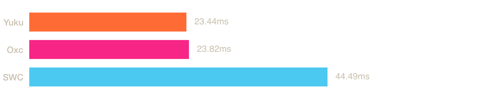

# ECMAScript Native Parser Benchmark

Benchmark ECMAScript parsers implemented in native languages.

## System

| Property | Value |
|----------|-------|
| OS | macOS 24.6.0 (arm64) |
| CPU | Apple M3 |
| Cores | 8 |
| Memory | 16 GB |

## Parsers

### [Yuku](https://github.com/yuku-toolchain/yuku)

**Language:** Zig

A high-performance & spec-compliant JavaScript/TypeScript compiler written in Zig.

### [Oxc](https://github.com/oxc-project/oxc)

**Language:** Rust

A high-performance JavaScript and TypeScript parser written in Rust.

### [SWC](https://github.com/swc-project/swc)

**Language:** Rust

An extensible Rust-based platform for compiling and bundling JavaScript and TypeScript.

### [Jam](https://github.com/srijan-paul/jam)

**Language:** Zig

A JavaScript toolchain written in Zig featuring a parser, linter, formatter, printer, and vulnerability scanner.

## Benchmarks

### [TypeScript](https://raw.githubusercontent.com/yuku-toolchain/parser-benchmark-files/refs/heads/main/typescript.js)

The TypeScript compiler source code bundled into a single file.

**File size:** 7.83 MB


| Parser | Mean | Min | Max | Peak Memory (RSS) |
|--------|------|-----|-----|----|
| Yuku | 28.15 ms | 27.58 ms | 29.00 ms | - |
| Oxc | 29.38 ms | 26.88 ms | 46.18 ms | - |
| Jam | 53.62 ms | 52.96 ms | 55.26 ms | - |
| SWC | 55.58 ms | 53.85 ms | 57.56 ms | - |

### [Three.js](https://raw.githubusercontent.com/yuku-toolchain/parser-benchmark-files/refs/heads/main/three.js)

A popular 3D graphics library for the web.

**File size:** 1.96 MB



| Parser | Mean | Min | Max | Peak Memory (RSS) |
|--------|------|-----|-----|----|
| Oxc | 7.50 ms | 7.07 ms | 20.51 ms | - |
| Yuku | 7.90 ms | 7.53 ms | 8.28 ms | - |
| SWC | 13.43 ms | 12.41 ms | 19.11 ms | - |
| Jam | 13.69 ms | 12.99 ms | 14.26 ms | - |

### [Ant Design](https://raw.githubusercontent.com/yuku-toolchain/parser-benchmark-files/refs/heads/main/antd.js)

A popular React UI component library with enterprise-class design.

**File size:** 5.43 MB



| Parser | Mean | Min | Max | Peak Memory (RSS) |
|--------|------|-----|-----|----|
| Yuku | 23.44 ms | 22.83 ms | 31.79 ms | - |
| Oxc | 23.82 ms | 23.02 ms | 34.26 ms | - |
| SWC | 44.49 ms | 43.49 ms | 47.47 ms | - |
| Jam | Failed to parse | - | - | - |

## Run Benchmarks

### Prerequisites

- [Bun](https://bun.sh/) - JavaScript runtime and package manager
- [Rust](https://www.rust-lang.org/tools/install) - For building Rust-based parsers
- [Zig](https://ziglang.org/download/) - For building Zig-based parsers (requires nightly/development version)
- [Hyperfine](https://github.com/sharkdp/hyperfine) - Command-line benchmarking tool

### Steps

1. Clone the repository:

```bash
git clone https://github.com/yuku-toolchain/ecmascript-native-parser-benchmark.git
cd ecmascript-native-parser-benchmark
```

2. Install dependencies:

```bash
bun install
```

3. Run benchmarks:

```bash
bun bench
```

This will build all parsers and run benchmarks on all test files. Results are saved to the `result/` directory.

## Methodology

### How Benchmarks Are Conducted

1. **Build Phase**: All parsers are compiled with release optimizations. Source files are embedded at compile time (Zig `@embedFile`, Rust `include_str!`) to eliminate file I/O from measurements:
   - Rust parsers: `cargo build --release` with LTO, single codegen unit, and symbol stripping
   - Zig parsers: `zig build --release=fast`

2. **Benchmark Phase**: Each parser is benchmarked using [Hyperfine](https://github.com/sharkdp/hyperfine):
   - 100 warmup runs to ensure stable measurements
   - Multiple timed runs for statistical accuracy
   - Results exported to JSON for analysis

3. **Measurement**: Each benchmark measures the total time to:
   - Parse the entire file into an AST (source is embedded at compile time, no file I/O)
   - Clean up allocated memory

### Test Files

The benchmark uses real-world JavaScript files from popular open-source projects to ensure results reflect practical performance characteristics.