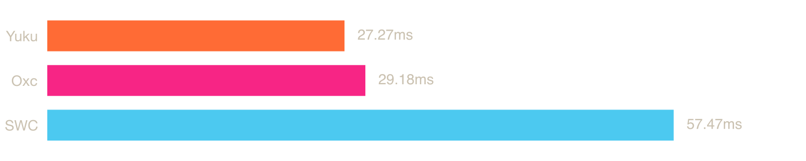
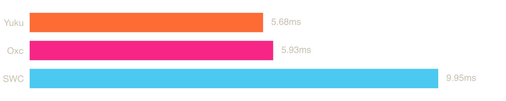

# Native ECMAScript Parser Benchmark

Benchmarks for ECMAScript parsers compiled to native binaries (Zig, Rust), measuring raw parsing speed without any JavaScript runtime overhead.

## System

| Property | Value |
|----------|-------|
| OS | macOS 24.6.0 (arm64) |
| CPU | Apple M3 |
| Cores | 8 |
| Memory | 16 GB |

## Parsers

### [Yuku](https://github.com/yuku-toolchain/yuku)

**Language:** Zig

A high-performance & spec-compliant JavaScript/TypeScript compiler written in Zig.

### [Oxc](https://github.com/oxc-project/oxc)

**Language:** Rust

A high-performance JavaScript and TypeScript parser written in Rust.

### [SWC](https://github.com/swc-project/swc)

**Language:** Rust

An extensible Rust-based platform for compiling and bundling JavaScript and TypeScript.

## Benchmarks

### [typescript.js](https://raw.githubusercontent.com/yuku-toolchain/parser-benchmark-files/refs/heads/main/typescript.js)

**File size:** 7.83 MB



| Parser | Median | Min | Max |
|--------|--------|-----|-----|
| Yuku | 27.27 ms | 26.76 ms | 28.60 ms |
| Oxc | 29.18 ms | 28.53 ms | 134.25 ms |
| SWC | 57.47 ms | 56.59 ms | 82.21 ms |

### [calcom.tsx](https://raw.githubusercontent.com/yuku-toolchain/parser-benchmark-files/refs/heads/main/calcom.tsx)

**File size:** 1.01 MB



| Parser | Median | Min | Max |
|--------|--------|-----|-----|
| Yuku | 5.68 ms | 5.45 ms | 9.30 ms |
| Oxc | 5.93 ms | 5.81 ms | 21.25 ms |
| SWC | 9.95 ms | 9.74 ms | 16.63 ms |

### [react.js](https://raw.githubusercontent.com/yuku-toolchain/parser-benchmark-files/refs/heads/main/react.js)

**File size:** 0.07 MB


| Parser | Median | Min | Max |
|--------|--------|-----|-----|
| Oxc | 1.48 ms | 1.37 ms | 9.10 ms |
| Yuku | 1.56 ms | 1.49 ms | 1.82 ms |
| SWC | 1.80 ms | 1.68 ms | 2.16 ms |

## Semantic

The ECMAScript specification defines a set of early errors that conformant implementations must report before execution. Some of these are detectable during parsing from local context alone, like `return` outside a function, `yield` outside a generator, invalid destructuring, etc. Others require knowledge of the program's scope structure and bindings, such as redeclarations, unresolved exports, private fields used outside their class, etc.

Parsers handle this differently: SWC checks some scope-dependent errors during parsing itself, while Yuku and Oxc defer them entirely to a separate semantic analysis pass. This keeps parsing fast and lets each consumer opt in only to the work it actually needs. A formatter, for example, only needs the AST and should not pay the cost of scope resolution.

The benchmarks below measure parsing followed by this additional pass, which builds a scope tree and symbol table, resolves identifier references to their declarations, and reports the remaining early errors. Together, parsing and semantic analysis cover the full set of early errors required by the specification.

### [typescript.js](https://raw.githubusercontent.com/yuku-toolchain/parser-benchmark-files/refs/heads/main/typescript.js)


| Parser | Median | Min | Max |
|--------|--------|-----|-----|
| Yuku + Semantic | 45.46 ms | 44.86 ms | 51.55 ms |
| Oxc + Semantic | 64.46 ms | 63.98 ms | 91.73 ms |

### [calcom.tsx](https://raw.githubusercontent.com/yuku-toolchain/parser-benchmark-files/refs/heads/main/calcom.tsx)


| Parser | Median | Min | Max |
|--------|--------|-----|-----|
| Yuku + Semantic | 8.54 ms | 8.40 ms | 8.80 ms |
| Oxc + Semantic | 10.15 ms | 9.97 ms | 10.46 ms |

### [react.js](https://raw.githubusercontent.com/yuku-toolchain/parser-benchmark-files/refs/heads/main/react.js)


| Parser | Median | Min | Max |
|--------|--------|-----|-----|
| Yuku + Semantic | 1.76 ms | 1.62 ms | 2.00 ms |
| Oxc + Semantic | 1.80 ms | 1.68 ms | 22.62 ms |

## Run Benchmarks

### Prerequisites

- [Bun](https://bun.sh/) - JavaScript runtime and package manager
- [Rust](https://www.rust-lang.org/tools/install) - For building Rust-based parsers
- [Zig](https://ziglang.org/download/) - For building Zig-based parsers (requires nightly/development version)
- [Hyperfine](https://github.com/sharkdp/hyperfine) - Command-line benchmarking tool

### Steps

1. Clone the repository:

```bash
git clone https://github.com/yuku-toolchain/ecmascript-parser-benchmark-native.git
cd ecmascript-parser-benchmark-native
```

2. Install dependencies:

```bash
bun install
```

3. Run benchmarks:

```bash
bun bench
```

This will build all parsers and run benchmarks on all test files. Results are saved to the `result/` directory.

## Methodology

All parsers are compiled with release optimizations. Source files are embedded at compile time (Zig `@embedFile`, Rust `include_str!`) to eliminate file I/O from measurements. Rust parsers are built with `cargo build --release` using LTO, a single codegen unit, and symbol stripping. Zig parsers are built with `zig build --release=fast`.

Each parser is benchmarked using [Hyperfine](https://github.com/sharkdp/hyperfine) with `--shell=none` to eliminate shell overhead, 30 warmup runs, and a minimum of 200 timed runs. Results use the **median** rather than the mean to provide stable, outlier-resistant measurements. In CI, the CPU frequency governor is set to `performance` mode and processes are pinned to a dedicated core to minimize scheduling noise. Each run measures the time to parse the entire file into an AST and free the allocated memory.