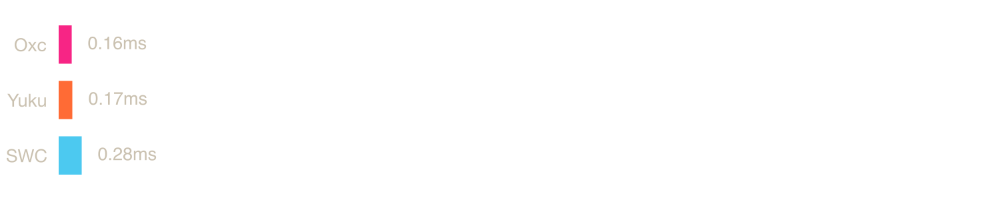

# Native ECMAScript Parser Benchmark

Benchmarks for ECMAScript parsers compiled to native binaries (Zig, Rust), measuring raw parsing speed without any JavaScript runtime overhead.

## System

| Property | Value |
|----------|-------|
| OS | macOS 24.6.0 (arm64) |
| CPU | Apple M3 |
| Cores | 8 |
| Memory | 16 GB |

## Parsers

### [Yuku](https://github.com/yuku-toolchain/yuku)

**Language:** Zig

A high-performance & spec-compliant JavaScript/TypeScript compiler written in Zig.

### [Oxc](https://github.com/oxc-project/oxc)

**Language:** Rust

A high-performance JavaScript and TypeScript parser written in Rust.

### [SWC](https://github.com/swc-project/swc)

**Language:** Rust

An extensible Rust-based platform for compiling and bundling JavaScript and TypeScript.

## Benchmarks

### [typescript.js](https://raw.githubusercontent.com/yuku-toolchain/parser-benchmark-files/refs/heads/main/typescript.js)

**File size:** 7.83 MB


| Parser | Median | Min | p99 |
|--------|--------|-----|-----|
| Yuku | 22.41 ms | 21.91 ms | 46.32 ms |
| Oxc | 23.95 ms | 23.85 ms | 25.92 ms |
| SWC | 42.33 ms | 41.21 ms | 64.93 ms |

### [calcom.tsx](https://raw.githubusercontent.com/yuku-toolchain/parser-benchmark-files/refs/heads/main/calcom.tsx)

**File size:** 1.01 MB


| Parser | Median | Min | p99 |
|--------|--------|-----|-----|
| Yuku | 3.50 ms | 3.45 ms | 3.73 ms |
| Oxc | 3.66 ms | 3.53 ms | 9.02 ms |
| SWC | 6.28 ms | 6.10 ms | 6.89 ms |

### [react.js](https://raw.githubusercontent.com/yuku-toolchain/parser-benchmark-files/refs/heads/main/react.js)

**File size:** 0.07 MB



| Parser | Median | Min | p99 |
|--------|--------|-----|-----|
| Yuku | 0.14 ms | 0.14 ms | 0.15 ms |
| Oxc | 0.16 ms | 0.16 ms | 0.18 ms |
| SWC | 0.28 ms | 0.27 ms | 0.30 ms |

## Semantic

The ECMAScript specification defines a set of early errors that conformant implementations must report before execution. Some of these are detectable during parsing from local context alone, like `return` outside a function, `yield` outside a generator, invalid destructuring, etc. Others require knowledge of the program's scope structure and bindings, such as redeclarations, unresolved exports, private fields used outside their class, etc.

Parsers handle this differently: SWC checks some scope-dependent errors during parsing itself, while Yuku and Oxc defer them entirely to a separate semantic analysis pass. This keeps parsing fast and lets each consumer opt in only to the work it actually needs. A formatter, for example, only needs the AST and should not pay the cost of scope resolution.

The benchmarks below measure parsing followed by this additional pass, which builds a scope tree and symbol table, resolves identifier references to their declarations, and reports the remaining early errors. Together, parsing and semantic analysis cover the full set of early errors required by the specification.

### [typescript.js](https://raw.githubusercontent.com/yuku-toolchain/parser-benchmark-files/refs/heads/main/typescript.js)


| Parser | Median | Min | p99 |
|--------|--------|-----|-----|
| Yuku + Semantic | 39.41 ms | 39.04 ms | 43.03 ms |
| Oxc + Semantic | 54.44 ms | 52.99 ms | 79.01 ms |

### [calcom.tsx](https://raw.githubusercontent.com/yuku-toolchain/parser-benchmark-files/refs/heads/main/calcom.tsx)


| Parser | Median | Min | p99 |
|--------|--------|-----|-----|
| Oxc + Semantic | 7.06 ms | 6.96 ms | 7.65 ms |
| Yuku + Semantic | 7.58 ms | 7.51 ms | 11.13 ms |

### [react.js](https://raw.githubusercontent.com/yuku-toolchain/parser-benchmark-files/refs/heads/main/react.js)


| Parser | Median | Min | p99 |
|--------|--------|-----|-----|
| Yuku + Semantic | 0.27 ms | 0.27 ms | 0.29 ms |
| Oxc + Semantic | 0.34 ms | 0.34 ms | 0.36 ms |

## Run Benchmarks

### Prerequisites

- [Bun](https://bun.sh/) - JavaScript runtime and package manager
- [Rust](https://www.rust-lang.org/tools/install) - For building Rust-based parsers
- [Zig](https://ziglang.org/download/) - For building Zig-based parsers (requires nightly/development version)

### Steps

1. Clone the repository:

```bash
git clone https://github.com/yuku-toolchain/ecmascript-parser-benchmark-native.git
cd ecmascript-parser-benchmark-native
```

2. Install dependencies:

```bash
bun install
```

3. Run benchmarks:

```bash
bun bench
```

This will build all parsers and run benchmarks on all test files. Results are saved to the `result/` directory.

## Methodology

Parsing is timed in-process to isolate it from process startup, dynamic linking, file I/O, and memory teardown, which would otherwise dominate the measurement on smaller files.

The source is read once, then each parser runs 50 warmup iterations followed by 300 timed iterations. A monotonic clock wraps only the parse call (plus the semantic pass for the semantic variants); allocation and teardown happen outside the timed region, and the result passes through an optimization barrier so the work cannot be elided. Reported figures are the median, minimum, and 99th percentile of the timed runs.

Binaries are built with release optimizations: Rust with `cargo build --release` (LTO, single codegen unit, symbol stripping) and Zig with `zig build --release=fast`. Each uses a fast general-purpose allocator (Rust `mimalloc`, Zig `smp_allocator`).